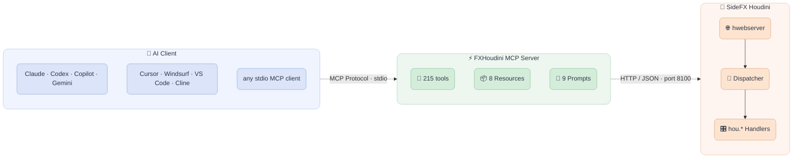

<div align="center">

  <p align="center">
    
  </p>

  <p align="center">
    <!-- Maintenance status -->
    &nbsp;&nbsp;
    <!-- License -->
    &nbsp;&nbsp;
    <!-- Last Commit -->
    &nbsp;&nbsp;
    <!-- Commit Activity -->
    <a href="https://github.com/healkeiser/fxhoudinimcp/pulse" alt="Activity">
      </a>&nbsp;&nbsp;
    <!-- PyPI version -->
    <a href="https://pypi.org/project/fxhoudinimcp/">
      </a>&nbsp;&nbsp;
    <!-- PyPI downloads -->
    <a href="https://pepy.tech/projects/fxhoudinimcp"></a>&nbsp;&nbsp;
    <!-- GitHub stars -->
    
  </p>

</div>

<!-- TABLE OF CONTENTS -->
## Table of Contents

- [About](#about)
- [Installation](#installation)
- [Usage](#usage)
- [Configuration](#configuration)
- [Security](#security)
- [Development](#development)
- [Contact](#contact)

<!-- ABOUT -->
## About

An [MCP](https://modelcontextprotocol.io/) server for [SideFX Houdini](https://www.sidefx.com/): it lets an AI assistant build networks, set up simulations, inspect USD stages and render, through Houdini's own Python API. It works with any MCP client: Claude, Codex, Copilot, Gemini, Cursor, Windsurf, VS Code, Cline and others.

**215 tools**, **8 resources**, and **9 prompts** serving **31 written workflow guides** out of the box.

<!-- --8<-- [start:features] -->
| Category | Tools | Description |
|----------|-------|-------------|
| **Graph Intelligence** | 6 | Atomic validated network building, network verification, node doc cards, cook profiling, frame-range cooking with per-frame evidence, cook status |
| **Documentation** | 3 | Full-text search + page retrieval over Houdini's own shipped manual (version-exact) |
| **Scene Management** | 10 | Open, save, import/export, scene info, connection status, undo/redo |
| **Sessions** | 3 | Switch between open Houdini sessions, start a headless or GUI Houdini of the server's own, stop it |
| **Node Operations** | 22 | Create, delete, copy, connect, layout, flags, network boxes, sticky notes, object transforms |
| **Parameters** | 14 | Get/set values in bulk, expressions, keyframes, spare parameters |
| **Geometry (SOPs)** | 16 | Points, prims, attributes, attribute statistics, volume statistics and sampling, groups, sampling, nearest-point search |
| **LOPs/USD** | 21 | Stage inspection, prims, world transforms over frames, layers, composition, variants, lighting |
| **DOPs** | 8 | Simulation info, DOP objects, step/reset, memory usage |
| **PDG/TOPs** | 12 | Cook, work items, failed items and logs, schedulers, dependency graphs |
| **COPs (Copernicus)** | 7 | Image nodes, layers, VDB data |
| **HDAs** | 13 | Create, install, manage Digital Assets, their versions and sections |
| **Animation** | 9 | Keyframes, playbar control, frame range |
| **Rendering** | 10 | Viewport capture, contact sheets of a frame range without a viewport, render nodes, settings, render launch |
| **VEX** | 5 | Create/edit wrangles, validate VEX code |
| **Code Execution** | 7 | Python, HScript, expressions, env variables, file references, update mode |
| **Viewport/UI** | 14 | Pane management, viewer context, verified camera and renderer state, screenshots, error detection |
| **Scene Context** | 8 | Network overview, cook chain, selection, scene summary, error analysis |
| **Workflows** | 8 | One-call Pyro/RBD/FLIP/Vellum setup, SOP chains, render config |
| **Materials** | 4 | List, inspect, create materials and shader networks |
| **CHOPs** | 4 | Channel data, CHOP nodes, export channels to parameters |
| **Cache** | 4 | List, inspect, clear, write file caches |
| **Takes** | 4 | List, create, switch takes with parameter overrides |
| **Shelf Tools** | 3 | Find, read and run Houdini's own shelf tools (setups build_network cannot produce) |
<!-- --8<-- [end:features] -->

<!-- --8<-- [start:architecture] -->


The plugin runs on Houdini's built-in `hwebserver` and executes every `hou.*` call on the main thread through `hdefereval`. The MCP server is a separate process your AI client starts; it relays tool calls to the plugin over loopback HTTP.
<!-- --8<-- [end:architecture] -->

<!-- INSTALLATION -->
<!-- --8<-- [start:installation] -->
## Installation

Requires Houdini 20.5+ (tested on 20.5, 21.0 and 22.0) and Python 3.10+ outside Houdini.

```shell
pip install fxhoudinimcp
python -m fxhoudinimcp install
```

Restart Houdini and your MCP client. An **MCP** menu appears in Houdini's menu bar.

`install` sets up both halves: it writes a Houdini package file into every Houdini packages directory it finds, and registers the server with every MCP client it finds (Claude Code, Claude Desktop, Codex, Copilot CLI, Gemini CLI, Cursor, Windsurf, VS Code, Cline). Use the `python -m` form: the Python that runs it is the one written into the client config.

| Flag | What it does |
| --- | --- |
| `--dry-run` | Report every change, make none |
| `--houdini-dir DIR` | Write into this packages directory only |
| `--client-only` | Register a client, leave Houdini untouched |
| `--client NAME` | Client to register, repeatable: `claude-code`, `claude-desktop`, `codex`, `copilot`, `gemini`, `cursor`, `windsurf`, `vscode`, `cline`. Default `auto` (every one detected); `none` to skip |

An existing `fxhoudini` client entry pointing at another Python is repointed, and the old value printed.

`pip install --upgrade fxhoudinimcp` upgrades both halves, since the plugin ships inside the wheel. The exception is a plugin loaded from a git clone, which you update with git.

### Uninstalling

`pip uninstall` alone leaves the package file and the client entry behind, and both then fail silently. Remove them first:

```shell
python -m fxhoudinimcp uninstall
pip uninstall fxhoudinimcp
```

| Flag | What it removes |
| --- | --- |
| `--dry-run` | Nothing. Lists what it would remove |
| `--houdini-dir DIR` | Only this packages directory, instead of every one found |
| `--client-only` | Only the client registration, leaving the package files |
| `--client NAME` | Which client to unregister from, repeatable; same names as `install`. Default `auto` takes every one with an entry |
| `--yes` | Skip the confirmation. Required when stdin is not a terminal |

### Installing by hand

For a clone, a locked-down machine, or untangling a broken setup.

**1. Point Houdini at the plugin.** Print the package file for this install, then write it:

```shell
fxhoudinimcp houdini-package
fxhoudinimcp houdini-package --write "~/Documents/houdini22.0/packages"
```

Don't type the plugin path by hand: it moves whenever the Python environment does. To load the plugin from a clone instead, write the package file yourself (the path must end in `/houdini`):

```json
{
  "env": [
    {
      "FXHOUDINIMCP": "C:/Users/you/code/fxhoudinimcp/houdini"
    }
  ],
  "path": "$FXHOUDINIMCP"
}
```

**2. Point your MCP client at the server.** Every client runs the same command, `<python> -m fxhoudinimcp`, where `<python>` is the absolute path of the Python that has `fxhoudinimcp` (`python -c "import sys; print(sys.executable)"`). Clients don't inherit your shell's PATH, and a bare `python` just shows as "disconnected".

CLI clients register it with their own command. File-based clients take this entry in their config file:

```json
{
  "mcpServers": {
    "fxhoudini": {
      "command": "C:\\Program Files\\Python311\\python.exe",
      "args": ["-m", "fxhoudinimcp"]
    }
  }
}
```

| Client | Register with | Remove with |
| --- | --- | --- |
| Claude Code | `claude mcp add --scope user fxhoudini -- <python> -m fxhoudinimcp` | `claude mcp remove fxhoudini -s user` |
| Codex | `codex mcp add fxhoudini -- <python> -m fxhoudinimcp` | `codex mcp remove fxhoudini` |
| Copilot CLI | `copilot mcp add fxhoudini -- <python> -m fxhoudinimcp` | `copilot mcp remove fxhoudini` |
| Gemini CLI | `gemini mcp add -s user fxhoudini <python> -m fxhoudinimcp` | `gemini mcp remove -s user fxhoudini` |
| Claude Desktop | `claude_desktop_config.json` in the app-data `Claude/` folder, key `mcpServers`; quit from the tray and relaunch | delete the entry |
| Cursor | `~/.cursor/mcp.json`, key `mcpServers` | delete the entry |
| Windsurf | `~/.codeium/windsurf/mcp_config.json`, key `mcpServers` | delete the entry |
| VS Code | user `mcp.json` (**MCP: Open User Configuration**), key `servers`, entry gets `"type": "stdio"` | delete the entry |
| Cline | `~/.cline/data/settings/cline_mcp_settings.json`, key `mcpServers` | delete the entry |

Any other stdio client takes `<python> -m fxhoudinimcp` as its command. `python -m fxhoudinimcp install --client-only` does this step for you.

### Troubleshooting

**No MCP menu in Houdini.** Houdini skipped the package file without saying so. Start it with `HOUDINI_PACKAGE_VERBOSE=1` and look for `Loading:` and `Processing:` lines for `fxhoudinimcp.json`. The usual causes:

- the plugin path in the file doesn't exist;
- the file starts with a UTF-8 BOM (PowerShell's `Set-Content -Encoding UTF8` adds one);
- another `fxhoudinimcp.json` in a later packages directory overrides it (`fxhoudinimcp houdini-package` lists them all, `uninstall` removes them);
- the Houdini version you launched has no package file (each version reads its own preferences directory).

On Windows, OneDrive can make a desktop-launched and a shell-launched Houdini read different preference directories; the package log shows which one is used.

**The client shows "disconnected".** Its config names a bare `python`; use the absolute path.

**A documented subcommand seems missing.** Check `python -m fxhoudinimcp --version`: an editable install reports the version it was created at.

**The assistant can't reach Houdini.** `get_houdini_connection_status` lists every Houdini serving the plugin and why a connection failed.
<!-- --8<-- [end:installation] -->

<!-- USAGE -->
## Usage

The plugin starts with Houdini's UI (`FXHOUDINIMCP_AUTOSTART`), and the **MCP** menu starts, stops and checks it. **MCP > Connect a Client...** shows the port this session actually got (a second Houdini takes the next free port), copies the command that registers the server with every client found, and lists the manual form for each client.

Then ask for things:

```
"Create a procedural rock generator with mountain displacement"
"Set up a Pyro simulation with a sphere source"
"Build a USD scene with a camera, dome light, and ground plane"
"Debug why my scene has cooking errors"
```

Every tool call is one undo step. Tools leave your selection, viewport camera and network editor where they were, so you can keep working in the scene while the assistant does.

<!-- CONFIGURATION -->
## Configuration

<!-- --8<-- [start:environment] -->
| Variable | Default | Read by | Description |
|----------|---------|---------|-------------|
| `FXHOUDINIMCP_PORT` | `8100` | Houdini | Port the plugin listens on; a second Houdini takes the next free one |
| `FXHOUDINIMCP_BIND` | `127.0.0.1` | Houdini | Address the plugin binds. See [Security](#security) before widening it |
| `FXHOUDINIMCP_AUTOSTART` | `1` | Houdini | `0` disables auto-start |
| `FXHOUDINIMCP_AUTO_LAYOUT` | `0` | both | `1` lets tools re-lay-out a network after changing it. Off, only new nodes are placed |
| `FXHOUDINIMCP_PROJECT_ROOT` | unset | Houdini | Confine hip, import, export and HDA files to this directory |
| `FXHOUDINIMCP_TIMEOUT` | `120` | Houdini | Seconds a command may run; `write_cache`, `start_render`, `cook_frame_range` and `press_button` have no deadline |
| `FXHOUDINIMCP_TIMEOUT_<COMMAND>` | unset | Houdini | Per-command override: `FXHOUDINIMCP_TIMEOUT_TOPS_COOK_TOP_NODE=900` |
| `FXHOUDINIMCP_OUTPUT_GRACE` | `2` | Houdini | Seconds a render or cache may take to show its file before it counts as not written |
| `FXHOUDINIMCP_TOKEN` | unset | both | Fixed bearer token instead of a generated one, for a client on another machine. Set the same value on both ends |
| `FXHOUDINIMCP_STATE_DIR` | `%LOCALAPPDATA%\fxhoudinimcp`, `~/.local/share/fxhoudinimcp` | both | Where Houdini writes `instances/<port>.json` with its token |
| `HOUDINI_HOST` | `localhost` | client | Houdini host |
| `HOUDINI_PORT` | scan 8100-8115 | client | Pin one Houdini port; switches off the scan |
| `HOUDINI_TIMEOUT` | plugin timeout + 15 | client | Seconds the client waits for a command |
| `MCP_TRANSPORT` | `stdio` | client | `stdio` or `streamable-http` |
| `LOG_LEVEL` | `INFO` | client | Logging level |

Houdini-side variables live in the package file `install` wrote, where every one sits at its default. They win over the same variables in your shell; `install` keeps your edits when it runs again. Client-side variables go in your MCP client's config.
<!-- --8<-- [end:environment] -->

<!-- SECURITY -->
## Security

<!-- --8<-- [start:security] -->
A connection to this server is a shell inside your Houdini session: `execute_python` runs arbitrary code, and there is no per-tool permission. It is built for one artist's workstation and an MCP client they trust.

- Every request needs a bearer token. Houdini generates one per start and writes it, with its port and pid, to `instances/<port>.json` in the state directory, which only your OS user can read. The client reads it from there.
- The plugin binds to loopback unless `FXHOUDINIMCP_BIND` says otherwise, and does not start if a loopback bind cannot be set.
- Stop Server makes every endpoint refuse and removes the token file. The port stays open, because hwebserver also serves Houdini's own features.
- Requests with an `Origin` header (a web page) or a non-loopback `Host` (DNS rebinding) are refused.
- `FXHOUDINIMCP_PROJECT_ROOT` confines the files the tools open, save, import, export, install or delete with `clear_cache`. It does not check paths written into parameters (a File SOP, a ROP output), and `execute_python` / `execute_hscript` are not sandboxed.
- Recovery from a bad change is undo, one step per tool call.
<!-- --8<-- [end:security] -->

<!-- DEVELOPMENT -->
## Development

See [CONTRIBUTING.md](CONTRIBUTING.md) for what CI checks.

```shell
pip install -e ".[dev]"
ruff check . && ruff format --check .
pytest                                  # unit tests, hou mocked
python tests/run_integration.py         # live suite in hython; needs a license seat, HYTHON picks the build
python tests/integration/gui_session_check.py   # against a running GUI Houdini
python tools/gen_node_versions.py       # add this machine's Houdini builds to the node table
python tools/gen_node_domains.py        # after gen_node_versions
python tools/gen_required_commands.py
python tools/gen_prompt_vocab.py        # node tables in the prompts; edit tools/prompt_vocab.json, not the markdown
```

With Red Giant / Maxon Universe installed, set `HOUDINI_DISABLE_OPENFX_DEFAULT_PATH=1`, or its OpenFX plug-in crashes hython on 20.5.487 and later.

Layout: the plugin is in `houdini/` (handlers under `scripts/python/fxhoudinimcp_server/handlers/`), the MCP server in `python/fxhoudinimcp/` (tools, bridge, prompts). Prompts are in `prompts/markdown/`: `instructions/` is sent to every client, `workflows/` holds one guide per SideFX help scope (`pyro.md` pairs with `pyro/`), `shared/` holds fragments.

**What a call costs.** Every command waits for a main-thread tick in Houdini, so call count, not work, sets a session's speed (Houdini 22.0.368, idle scene):

| | |
| --- | --- |
| `health_check` (no main-thread hop) | 0.5 ms |
| any command, even on an empty network | ~50 ms |
| 10 nodes, one call each | ~800 ms |
| the same 10 in one `build_network` | ~66 ms |

<!-- CONTACT -->
## Contact

Project Link: [fxhoudinimcp](https://github.com/healkeiser/fxhoudinimcp)

<p align='center'>
  <!-- GitHub profile -->
  <a href="https://github.com/healkeiser">
    </a>&nbsp;&nbsp;
  <!-- LinkedIn -->
  <a href="https://www.linkedin.com/in/valentin-beaumont">
    </a>&nbsp;&nbsp;
  <!-- Behance -->
  <a href="https://www.behance.net/el1ven">
    </a>&nbsp;&nbsp;
  <!-- X -->
  <a href="https://twitter.com/valentinbeaumon">
    </a>&nbsp;&nbsp;
  <!-- Instagram -->
  <a href="https://www.instagram.com/val.beaumontart">
    </a>&nbsp;&nbsp;
  <!-- Gumroad -->
  <a href="https://healkeiser.gumroad.com/subscribe">
    </a>&nbsp;&nbsp;
  <!-- Gmail -->
  <a href="mailto:valentin.onze@gmail.com">
    </a>&nbsp;&nbsp;
  <!-- Buy me a coffee -->
  <a href="https://www.buymeacoffee.com/healkeiser">
    </a>&nbsp;&nbsp;
</p>

## License

MIT
